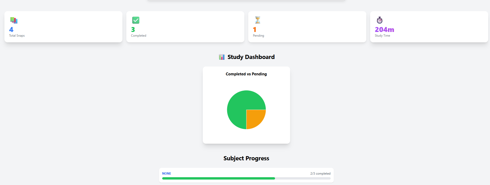
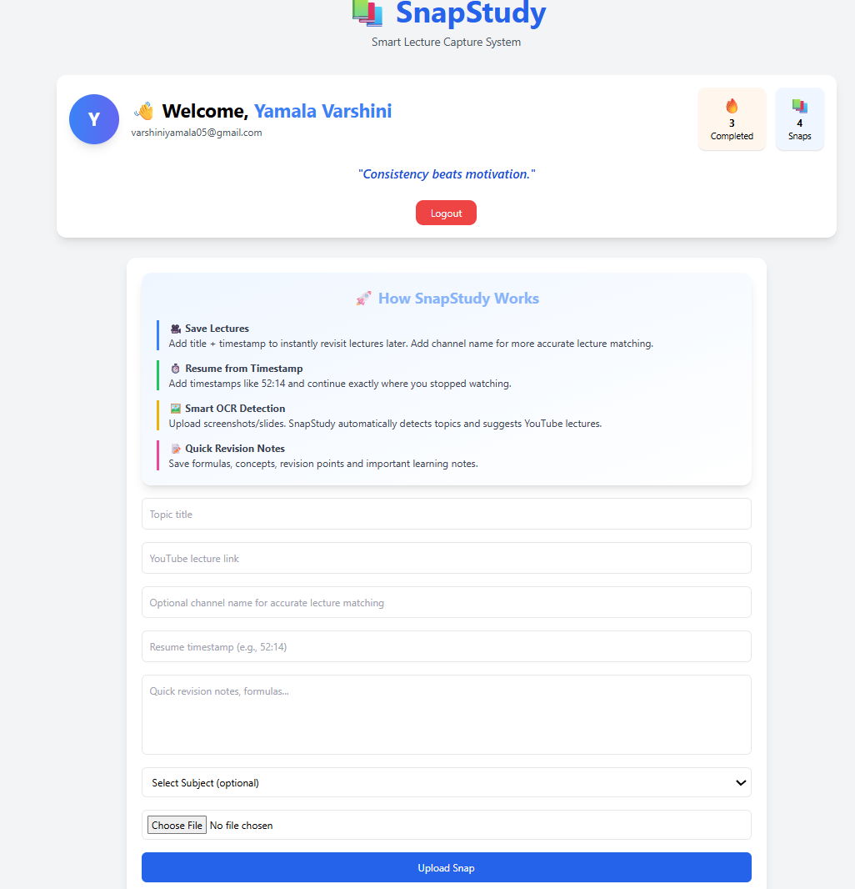
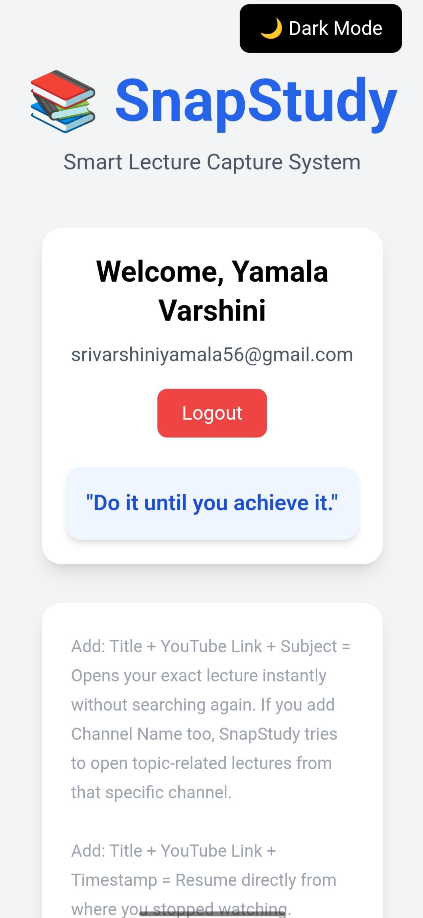
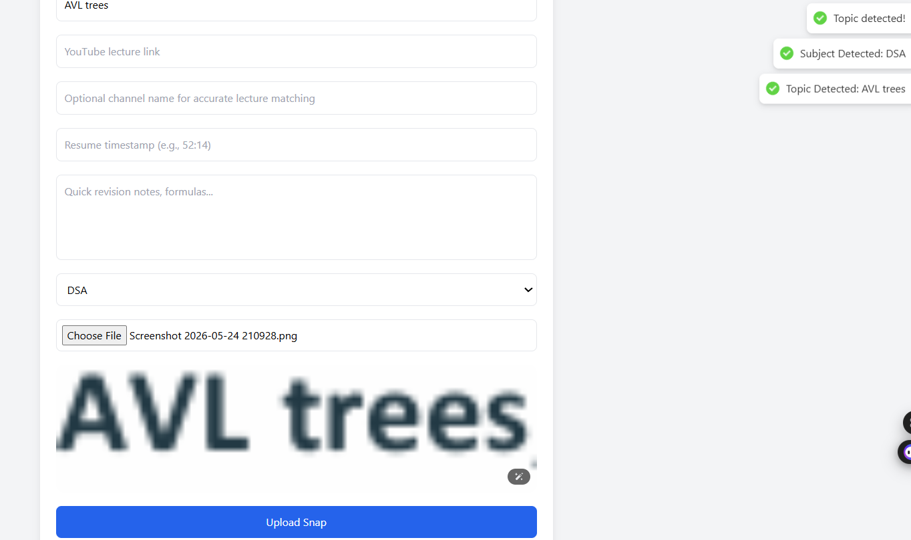
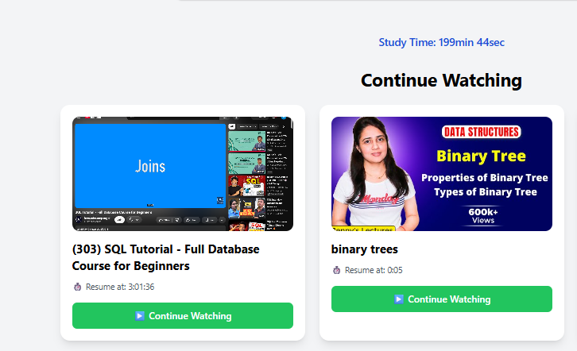
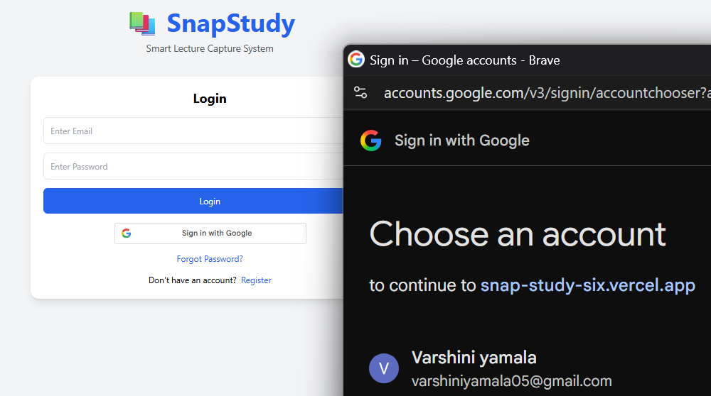

# SnapStudy

### AI-Powered Lecture Revision & Timestamp Navigation Platform

SnapStudy is a smart lecture capture and revision platform designed to help students save important moments from long YouTube lectures and revisit them quickly.

Instead of searching through an entire lecture again, students can save a lecture screenshot, exact timestamp, notes, and subject information in one place. Later, they can continue watching directly from the saved timestamp.

---

## Live Demo

**Frontend:**  
https://snap-study-six.vercel.app

---

## Problem Statement

While studying from long YouTube lectures, students often find an important concept but later struggle to remember exactly where it was explained.

Searching through the entire video again wastes time.

SnapStudy solves this problem by combining:

- Lecture screenshot
- Exact video timestamp
- Revision notes
- Subject organization
- OCR-based topic detection
- Revision status tracking
- Direct timestamp-based video navigation

---

## Key Features

### 1. Smart Lecture Capture

Students can save important lecture moments along with:

- Topic title
- YouTube lecture link
- Exact timestamp
- Channel name
- Revision notes
- Subject
- Screenshot

---

### 2. Timestamp Resume Navigation

Saved lectures can be opened directly from the stored timestamp.

For example:

YouTube Video
       ↓
Saved Timestamp: 3:01:36
       ↓
Click "Continue"
       ↓
YouTube opens at the saved point

## Screenshots

### Dashboard

### Snap Management

### Mobile UI

### OCR Detection

### Continue Watching

### Authentication
